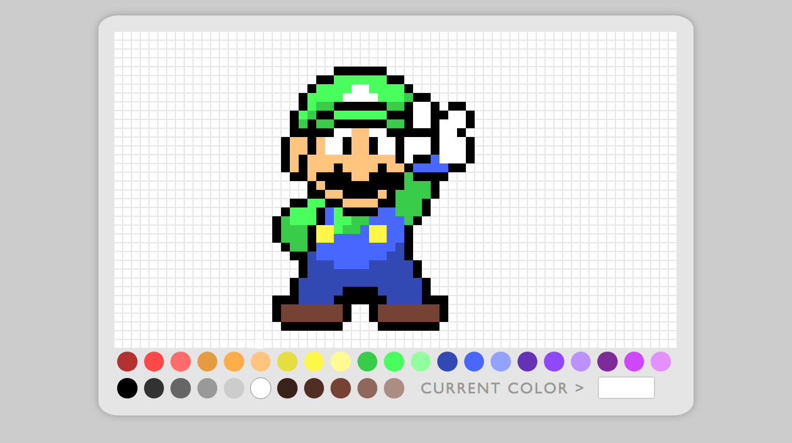

# Pixel Art Maker

In this exercise, you'll create your own pixel art maker which will allow a user to choose colors from a palette and then paint pixel art. The interface is completely up to you, but it could look something like this.

More specifically, your pixel art maker should allow a user to do the following.

1. Start with a blank canvas of pixels.
1. Select a brush color from a palette of colors.
1. Paint the pixels on the canvas using the brush color.
1. Repeat step 2.

Here's a development workflow that we recommend you use.

1. Fork and clone this repository.
1. Create a small, 2x2 grid canvas made up of white, square `div` tags with a border.
1. Add an event listener to each `div` so when clicked the background turns red.
1. Create a small palette of two colors (e.g. red and blue) below the canvas using more `div` tags.
1. Add an event listener to these `div` tags so when clicked the brush color is saved.
1. Expand the dimensions of the pixel canvas.
1. Expand the palette with more colors. (i.e. red, orange, yellow, green, blue, purple, brown, gray, black, white, etc.)
1. Expand the palette with a brush color indicator.
1. Improve the look and feel of the canvas and color palette. Be careful not to break your program's behavior!

**TIP:** Check out [this handy tool](http://www.colors.commutercreative.com/grid/) to see a list of all the named colors in CSS.

### Bonus 1

Improve the mouse so it behaves like a real paintbrush. In other words, allow the user to paint by clicking and dragging across the canvas. For this, you'll need a combination of the `mousedown`, `mouseenter`, and `mouseup` events.

**TIP:** The [`mouseenter` event](https://developer.mozilla.org/en-US/docs/Web/Events/mouseenter) doesn't bubble up the DOM tree.

### Bonus 2

Add a color picker which allows the user to select any brush color using the [`<input type="color">` tag](https://developer.mozilla.org/en-US/docs/Web/HTML/Element/input/color) and the [`change` event](https://developer.mozilla.org/en-US/docs/Web/Events/change).

### Bonus 3

Research [LocalStorage](https://developer.mozilla.org/en-US/docs/Web/API/Storage/LocalStorage) and make a way to Save and Load a drawing.  Research [JSON.stringify](https://developer.mozilla.org/en-US/docs/Web/JavaScript/Reference/Global_Objects/JSON/stringify) and [JSON.parse](https://developer.mozilla.org/en-US/docs/Web/JavaScript/Reference/Global_Objects/JSON/parse) as a way to put the drawing into LocalStorage.

### Bonus 4

Create a fill tool that will [flood fill](https://en.wikipedia.org/wiki/Flood_fill) boundaries with a chosen paint color. 

### Deployment

Read over the following articles to learn how to deploy this web site to Surge.

- [Getting started with Surge](http://surge.sh/help/getting-started-with-surge)
- [Remembering a domain](http://surge.sh/help/remembering-a-domain)

A good domain name for this project is `USERNAME-pixel-art-maker.surge.sh` where `USERNAME` is your GitHub username in all **lowercase** letters. Once deployed and everything works as you expect, copy your Surge URL and paste it at the top of your GitHub repository's page.

### Resources

- [addEventListener](https://developer.mozilla.org/en-US/docs/Web/API/EventTarget/addEventListener)
- [className](https://developer.mozilla.org/en-US/docs/Web/API/Element/className)
- [style](https://developer.mozilla.org/en-US/docs/Web/API/HTMLElement/style)
- [querySelector](https://developer.mozilla.org/en-US/docs/Web/API/Document/querySelector)
- [appendChild](https://developer.mozilla.org/en-US/docs/Web/API/Node/appendChild)
