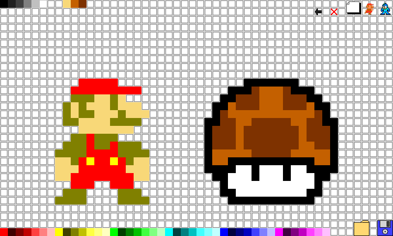

# Assignment - Pixel Art Maker

Create your own Pixel Art Maker, which lets you click on a grid to "paint" pixel art.  The interface is completely up to you, but it could look something like this:

It boils down to this: A user selects a color and clicks on pixels to paint them with the selected color.

Here's the order of steps that I would implement:

1. Get 10 or so small divs on the screen
2. Add an event listener to each so that when I click on a pixel it turns red
3. Add a color palette div with 2 colors(red and purple)which allows the user to set the current "paintbrush" color instead of it always being set to red
4. Add the rest of the standard rainbow colors to the color palette
5. Add enough divs to fill up the entire screen

**Bonus Challenges:**

* Add a color picker which allows the user to select any color. Look into the HTML5 color input.
* Add the ability to click and drag to paint multiple pixels at once
* Add a paintbucket tool which allows a user to drag a box across the screen and paint all pixels that fall inside that box
